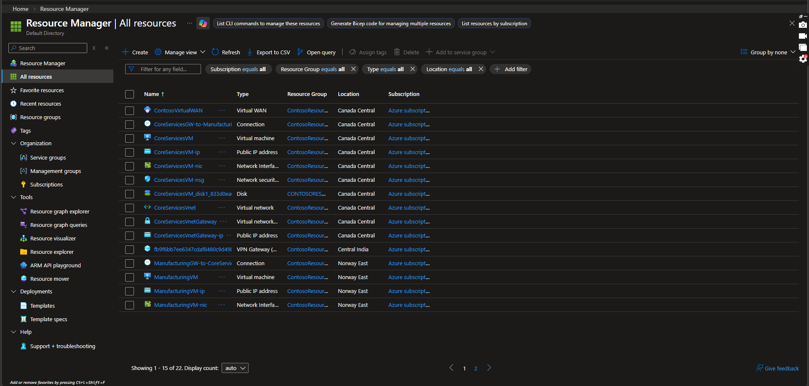

# Azure Application Gateway Lab

Building a real-world Azure Application Gateway environment from scratch — backend virtual machines, IIS installation, backend health validation, and load-balanced traffic testing in Central India. All deployed with ARM templates & PowerShell.

* * *

## Lab Overview

This lab covers end-to-end Azure Application Gateway configuration for the fictional company Contoso, deploying backend web servers and validating traffic distribution through the gateway in Central India.

Region Resource  
Central India ContosoVNet, ContosoAppGateway, BackendVM1, BackendVM2

* * *

## Architecture

* 1 Virtual Network in Central India
* 1 Azure Application Gateway
* 2 Backend Virtual Machines
* 1 Public IP attached to the Application Gateway
* 1 Backend Pool serving HTTP traffic on port 80
* IIS installed and configured on both backend VMs

* * *

## Files

File Description  
`backend-centralindia.json` ARM template to deploy backend virtual machines and networking resources  
`backend-centralindia.parameters.json` Parameters for backend deployment  
`install-iis-centralindia.ps1` PowerShell script to install and configure IIS on both backend VMs  

* * *

## Deployment Steps

### Task 1 — Deploy Backend Resources

```powershell
$RGName = "ContosoResourceGroup"
New-AzResourceGroupDeployment -ResourceGroupName $RGName -TemplateFile backend-centralindia.json -TemplateParameterFile backend-centralindia.parameters.json
```

This deployment creates:
- BackendVM1
- BackendVM2
- Network interfaces for both VMs
- Supporting resources in Central India

### Task 2 — Install IIS on BackendVM1

```powershell
Invoke-AzVMRunCommand -ResourceGroupName 'ContosoResourceGroup' -Name 'BackendVM1' -CommandId 'RunPowerShellScript' -ScriptPath 'install-iis-centralindia.ps1'
```

### Task 3 — Install IIS on BackendVM2

```powershell
Invoke-AzVMRunCommand -ResourceGroupName 'ContosoResourceGroup' -Name 'BackendVM2' -CommandId 'RunPowerShellScript' -ScriptPath 'install-iis-centralindia.ps1'
```

The script installs IIS and customizes the default page so each server displays its own VM name.

### Task 4 — Validate Backend Health

In Azure Portal:

* Open ContosoAppGateway
* Go to Backend health
* Confirm both backend servers are marked Healthy
* Verify that the probe receives HTTP 200 status code

Expected healthy backend IPs:  
`10.0.1.4`  
`10.0.1.5`

### Task 5 — Test Through the Application Gateway Public IP

Open the Application Gateway public IP in the browser:

```http
http://20.219.244.30
```

Refresh multiple times to confirm responses from:
- BackendVM1
- BackendVM2

This verifies that the Application Gateway is successfully routing traffic to both backend servers.

* * *

## Screenshots

### All Resources



### Application Gateway Backend Health


### Browser Test — BackendVM1


### Browser Test — BackendVM2


* * *

## Validation Results

* Both backend VMs deployed successfully
* IIS installed and running on both servers
* Azure Application Gateway backend health shows both servers as Healthy
* Health probe returned 200 OK
* Browser testing confirmed successful routing to both backend servers

* * *

## Technologies Used

* Azure Application Gateway
* Azure Virtual Network
* Azure Virtual Machines
* ARM Templates
* PowerShell (Az Module)
* IIS

* * *

## Author

Mina Gaballa
